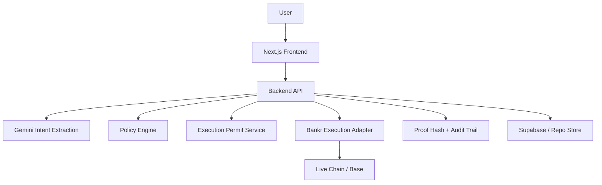
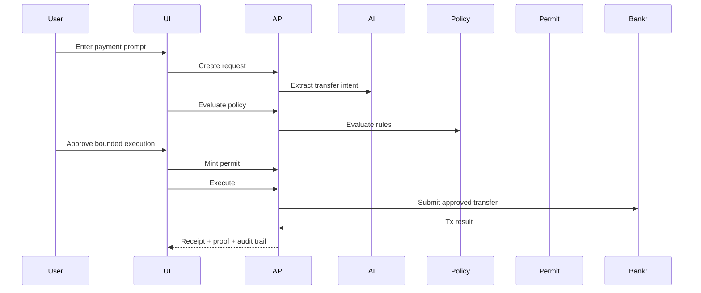

# High-Level Design

## System Goal

Transform natural-language payment requests into bounded, Bankr-executed transfers with a verifiable audit trail.

## Architecture Overview

## Main Lifecycle

