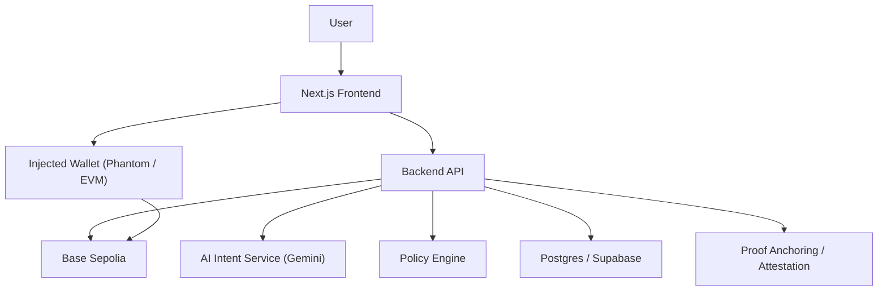
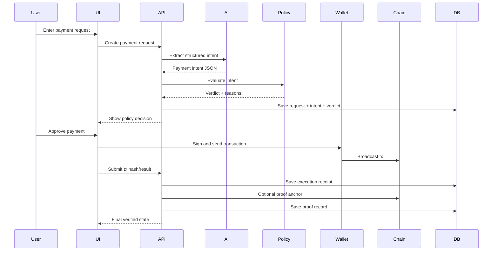

# High-Level Design

## System Goal

Transform natural-language payment instructions into safe and verifiable wallet actions.

## Architecture Overview

## Main Components

### 1. Frontend

Responsibilities:

- wallet connection
- natural-language request input
- display structured intent
- show policy results and risks
- allow user approval
- show execution status and proof trail

### 2. Backend API

Responsibilities:

- receive payment requests
- call AI service to extract intent
- validate intent schema
- evaluate policies
- store lifecycle records
- return transaction payload for execution
- persist execution and proof metadata

### 3. AI Intent Service

Responsibilities:

- turn prompt into strict JSON
- produce explanation text
- produce confidence/risk hints

Critical constraint:

- AI output is advisory, not authoritative

### 4. Policy Engine

Responsibilities:

- check transaction amount thresholds
- validate recipient allowlist or blocklist
- enforce manual approval rules
- generate policy verdict and reasons

### 5. Audit Store

Responsibilities:

- store request, intent, verdict, approval, execution, and proof records
- maintain immutable-looking lifecycle history

### 6. On-Chain Layer

Responsibilities:

- execute final payment from user wallet
- optionally anchor proof hash or attestation

## Core Workflow

## HLD Decisions

### Why Frontend-Signed Transactions

This is safer and simpler than backend-held private keys. It also gives a judge a visible approval step.

### Why AI Runs Server-Side

- keeps API keys private
- simplifies prompt control
- lets us enforce schema validation before UI sees the result

### Why Proof Storage Has Two Layers

- database for full readable records
- blockchain for immutable anchor / proof reference

This balances usability and verifiability.
