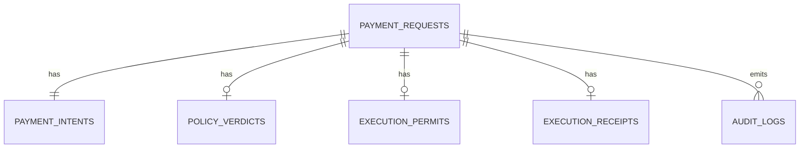

# Data Model

## Core Entities

- `payment_requests`
- `payment_intents`
- `policy_verdicts`
- `execution_permits`
- `execution_receipts`
- `audit_logs`

## Relationship Summary

## Table Notes

### `payment_requests`

- raw prompt
- lifecycle status
- created and updated timestamps

### `payment_intents`

- recipient input
- recipient kind
- amount in ETH and wei
- asset
- reason
- confidence
- execution mode
- raw extracted JSON

### `policy_verdicts`

- verdict: `approved | manual_review | blocked`
- reasons
- risk score
- max amount policy applied
- recipient resolution result

### `execution_permits`

- allowed recipient
- allowed asset
- max amount
- chain target
- expiry
- nonce
- approval artifact

### `execution_receipts`

- provider: `bankr`
- chain target and chain id
- tx hash if live
- proof hash
- explorer url
- raw Bankr response or failure details

### `audit_logs`

- actor type
- event type
- message
- event payload
- created timestamp
