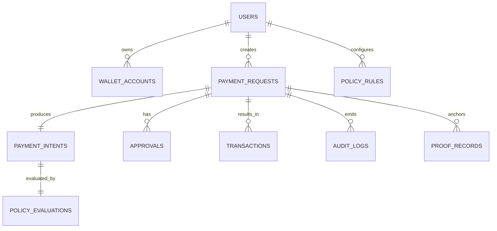

# Data Model

## Entity Relationship Summary

## Tables

### `users`

| Column | Type | Notes |
| --- | --- | --- |
| id | uuid | PK |
| name | text | display name |
| email | text | optional for MVP |
| created_at | timestamptz | |

### `wallet_accounts`

| Column | Type | Notes |
| --- | --- | --- |
| id | uuid | PK |
| user_id | uuid | FK -> users.id |
| address | text | unique wallet address |
| chain_id | int | 84532 for Base Sepolia |
| wallet_label | text | Phantom |
| created_at | timestamptz | |

### `payment_requests`

| Column | Type | Notes |
| --- | --- | --- |
| id | uuid | PK |
| user_id | uuid | FK |
| wallet_account_id | uuid | FK |
| raw_prompt | text | natural-language request |
| status | text | `draft`, `pending_approval`, `approved`, `rejected`, `executed`, `failed` |
| current_step | text | UI helper |
| created_at | timestamptz | |
| updated_at | timestamptz | |

### `payment_intents`

| Column | Type | Notes |
| --- | --- | --- |
| id | uuid | PK |
| payment_request_id | uuid | FK |
| recipient_address | text | EVM address |
| recipient_label | text | optional |
| amount_wei | numeric | integer string in app layer |
| token_symbol | text | `ETH` for MVP |
| reason | text | purpose |
| chain_id | int | |
| confidence_score | numeric | 0-1 |
| extracted_json | jsonb | raw normalized AI output |
| explanation | text | human-readable summary |
| created_at | timestamptz | |

### `policy_rules`

| Column | Type | Notes |
| --- | --- | --- |
| id | uuid | PK |
| user_id | uuid | FK |
| rule_type | text | `max_amount`, `recipient_allowlist`, `manual_review_threshold` |
| rule_config | jsonb | settings |
| is_active | boolean | |
| created_at | timestamptz | |

### `policy_evaluations`

| Column | Type | Notes |
| --- | --- | --- |
| id | uuid | PK |
| payment_intent_id | uuid | FK |
| verdict | text | `approved`, `manual_review`, `blocked` |
| risk_score | numeric | 0-100 |
| reasons | jsonb | list of rule results |
| created_at | timestamptz | |

### `approvals`

| Column | Type | Notes |
| --- | --- | --- |
| id | uuid | PK |
| payment_request_id | uuid | FK |
| approved_by_wallet | text | wallet address |
| decision | text | `approved`, `rejected` |
| note | text | optional |
| created_at | timestamptz | |

### `transactions`

| Column | Type | Notes |
| --- | --- | --- |
| id | uuid | PK |
| payment_request_id | uuid | FK |
| tx_hash | text | unique |
| chain_id | int | |
| explorer_url | text | |
| execution_status | text | `submitted`, `confirmed`, `failed` |
| block_number | bigint | optional |
| receipt_json | jsonb | raw chain receipt |
| created_at | timestamptz | |
| updated_at | timestamptz | |

### `proof_records`

| Column | Type | Notes |
| --- | --- | --- |
| id | uuid | PK |
| payment_request_id | uuid | FK |
| proof_type | text | `db_hash`, `attestation`, `onchain_anchor` |
| payload_hash | text | sha256 of receipt bundle |
| anchor_tx_hash | text | optional |
| anchor_reference | text | optional |
| metadata | jsonb | |
| created_at | timestamptz | |

### `audit_logs`

| Column | Type | Notes |
| --- | --- | --- |
| id | uuid | PK |
| payment_request_id | uuid | FK |
| actor_type | text | `user`, `ai`, `system`, `wallet` |
| event_type | text | lifecycle event |
| event_payload | jsonb | event data |
| created_at | timestamptz | |

## Lifecycle Status Transitions

`draft -> pending_approval -> approved -> executed`

Other exits:

- `pending_approval -> rejected`
- `approved -> failed`

## Notes

- `jsonb` fields let us move fast during the hackathon
- the normalized columns still make queries simple for the dashboard
- audit records must be append-only at the application level
